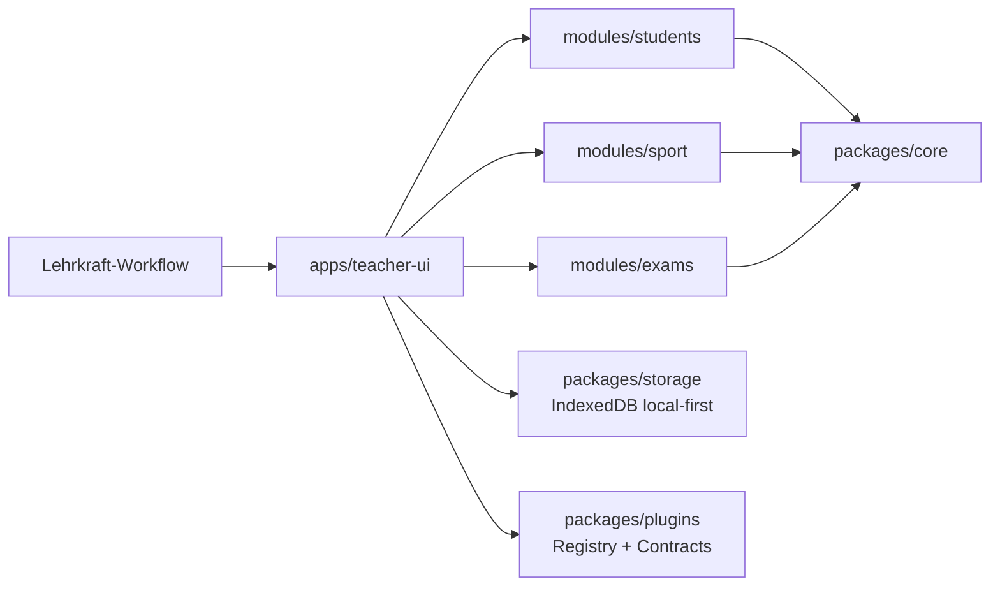

<a id="top"></a>

<div align="center">

# ViccoBoard

**Der modulare digitale Teaching Assistant fuer Lehrkraefte:** lokal-first, iPadOS/Safari-tauglich und so aufgebaut, dass neue Faecher-Module ohne Core-Umbau wachsen koennen.

[Deutsch](./README.md) | [English](./README.en.md)

[![CI][badge-ci]][ci]
[![CodeQL][badge-codeql]][codeql]
[![Scorecard Workflow][badge-scorecard-workflow]][scorecard-workflow]
[![OpenSSF Scorecard][badge-scorecard]][scorecard]
[![License][badge-license]][license]
[![Stars][badge-stars]][stargazers]
[![Forks][badge-forks]][network]
[![Issues][badge-issues]][issues]
[![PRs][badge-prs]][pulls]
[![Contributors][badge-contributors]][contributors]
[![Last Commit][badge-last-commit]][commits]

ViccoBoard hilft Lehrkraeften, Unterrichtsorganisation, Leistungsbewertung und Pruefungsarbeit in **einer** App zu buendeln.
Der Kern ist bewusst modular: bereits heute mit Sport + KBR-Pruefungsbausteinen, langfristig fuer weitere Faecher und Schulformen.

[Quickstart](#schnellstart) · [Dokumentation](./INDEX.md) · [Roadmap](#roadmap-now-next-later-vision) · [Mitmachen](./CONTRIBUTING.md)

</div>

## Inhaltsverzeichnis

- [Warum ViccoBoard?](#warum-viccoboard)
- [Das Alleinstellungsmerkmal: Modular by Design](#das-alleinstellungsmerkmal-modular-by-design)
- [Feature Highlights (Today)](#feature-highlights-today)
- [Feature Matrix (Today)](#feature-matrix-today)
- [Screenshots und GIFs](#screenshots-und-gifs)
- [Technische Exzellenz](#technische-exzellenz)
- [Schnellstart](#schnellstart)
- [Roadmap (Now / Next / Later = Vision)](#roadmap-now-next-later-vision)
- [Contributing (Lehrkraefte + Devs)](#contributing-lehrkraefte--devs)
- [OpenSSF Best Practices Badge (CII)](#openssf-best-practices-badge-cii)
- [Weitere Metriken (Setup noetig)](#weitere-metriken-setup-noetig)
- [Community und Philosophie](#community-und-philosophie)
- [Lizenz](#lizenz)
- [Acknowledgements](#acknowledgements)

## Warum ViccoBoard?

Lehrkraefte arbeiten oft mit vielen Inselloesungen: Klassenlisten hier, Notenlogik dort, Korrektur-Notizen wieder woanders.
ViccoBoard fuehrt diese Arbeit in einer lokalen App zusammen, damit Unterrichtsentscheidungen schneller, konsistenter und nachvollziehbarer werden.

Im Fokus stehen dabei:

- **Praxistauglichkeit im Alltag**: schnelle Eingaben, klare Flows, wenig Klickwege
- **Datensouveraenitaet**: lokale Speicherung als Standard
- **Web-first fuer Schule**: explizit auf iPadOS/Safari ausgelegt
- **Wachstum ohne Neustart**: neue Domainen ueber Module/Plugins statt monolithischer Umbauten

[Zurueck nach oben](#top)

## Das Alleinstellungsmerkmal: Modular by Design

ViccoBoard ist nicht als starres "fertiges Tool" gedacht, sondern als **erweiterbare Unterrichtsplattform**.
Die Idee dahinter in Lehrkraft-Sprache: Wir bauen einen stabilen Kern (Navigation, Datenhaltung, Sicherheits- und Qualitaetsregeln) und ergaenzen dann fachspezifische Module wie Bausteine.

Heute sind bereits zwei Domainen im Fokus: **Sport** und **KBR/Pruefungen**.
Morgen kann dasselbe Muster fuer weitere Faecher und Schulformen genutzt werden, ohne den Kern neu zu schreiben.
So entsteht praktisch unbegrenzte Tiefe - nicht durch ein riesiges Einmal-Release, sondern durch klare, wiederverwendbare Module.

Das Plugin-System erweitert diese Module um Faehigkeiten wie Assessment-Logik, Tools oder Exporter.
Damit bleibt der Core schlank, waehrend Funktionalitaet kontrolliert wachsen kann.



[Zurueck nach oben](#top)

## Feature Highlights (Today)

- Klassenmanagement mit Erstellen, Bearbeiten, Archivieren und Farbcodierung
- Schuelerverwaltung mit Suche, Filter, Sortierung, CSV-Import und Bulk-Delete
- Anwesenheitserfassung pro Stunde inkl. konfigurierbarem Statuskatalog (pro Klasse)
- Stundenverwaltung mit Datumsfiltern und direkter Verknuepfung zur Anwesenheit
- Bewertungskategorien fuer mehrere Typen (Kriterien, Zeit, Cooper, Shuttle, Mittelstrecke, Sportabzeichen, BJS)
- Spezifische Eingabeflows fuer Sport-Bewertungen inkl. Historienansicht
- Sportabzeichen-Logik mit alters-/geschlechtsabhaengiger Auswertung plus PDF-Uebersicht
- Live-Tool Timer (Countdown, Stoppuhr, Intervalle, Rundenzeiten, Session-Speicherung)
- Team-Einteilung mit optionaler Filterung nach letzter Anwesenheit
- Scoreboard-Ansicht fuer schnelle Spielstandserfassung im Unterricht
- KBR Exam Builder (einfach/komplex) mit Aufgaben, Kriterien, Pruefungsteilen und Notenschluessel-Basis
- Lokalisierung vorbereitet (de/en), lokale Speicherung ueber IndexedDB-Migrationspfad

[Zurueck nach oben](#top)

## Feature Matrix (Today)

| Lehrkraft-Workflow | Heute verfuegbar | Status | Repo-Nachweis |
|---|---|---|---|
| Planung & Klassenorganisation | Klassen anlegen/bearbeiten/archivieren, Farben, Dashboard-Quick-Actions | Verfuegbar | `apps/teacher-ui/src/views/Dashboard.vue`, `ClassDetail.vue` |
| Stundenorganisation | Stunden anlegen, filtern, bearbeiten, loeschen | Verfuegbar | `apps/teacher-ui/src/views/LessonList.vue` |
| Schuelerverwaltung | CRUD, Suche, Filter, CSV-Import, Bulk-Delete | Verfuegbar | `apps/teacher-ui/src/views/StudentList.vue` |
| Schuelerprofil | Basisroute vorhanden | Teilweise | `apps/teacher-ui/src/views/StudentProfile.vue` |
| Anwesenheit | Schnellstatus + konfigurierbarer Statuskatalog + Batch-Speichern | Verfuegbar | `AttendanceEntry.vue`, `modules/students/src/repositories/status-catalog.repository.ts` |
| Sport-Bewertung | Kategorieverwaltung + mehrere Bewertungsmodi | Verfuegbar | `GradingOverview.vue`, `modules/sport/src/services/*.ts` |
| Sportabzeichen | Alterslogik + PDF-Export | Verfuegbar | `SportabzeichenGradingEntry.vue`, `modules/sport/src/services/sportabzeichen.service.ts` |
| Live-Tools im Unterricht | Timer, Team Builder, Scoreboard | Verfuegbar | `Timer.vue`, `TeamBuilder.vue`, `Scoreboard.vue` |
| Weitere Live-Tools | Taktikboard, Turniere, Feedback | In Arbeit | `TacticsBoard.vue`, `Tournaments.vue`, `FeedbackTool.vue` |
| Pruefungsaufbau (KBR) | Exam-Builder-Flows (einfach/komplex) + Persistenzgrundlage | Verfuegbar | `KBRExamBuilder.vue`, `SimpleExamBuilder.vue`, `modules/exams/src/repositories/*` |
| Korrektur (KBR) | Kompakte Korrektur-Views und Regelbausteine vorhanden | Teilweise | `CorrectionCompact.vue`, `CorrectionCompactUI_v2.vue`, `modules/exams/src/services/*` |
| Local-first Datenhaltung | IndexedDB-Storage mit Migrationen (Browser), SQLite-Demo fuer CLI | Verfuegbar | `apps/teacher-ui/src/services/storage.service.ts`, `packages/storage/src/*`, `apps/demo/src/index.ts` |

[Zurueck nach oben](#top)

## Screenshots und GIFs

Aktuell liegen im Repo noch keine kuratierten Produkt-Screenshots fuer die Landing Page.
Wenn du helfen willst, sind Pull Requests mit **anonymisierten** Screenshots/GIFs willkommen.

So kannst du beitragen:

1. Nimm eine reale Unterrichtsszene auf (z. B. Anwesenheit, Timer, Bewertungsflow)
2. Entferne personenbezogene Daten
3. Lege Assets unter `docs/` ab (z. B. `docs/assets/`)
4. Verlinke sie in README + PR-Beschreibung mit kurzem Kontext

[Zurueck nach oben](#top)

## Technische Exzellenz

### Prinzipien

- **Local-first** als Standardbetrieb
- **iPadOS/Safari (WebKit)** als explizites Ziel
- **Klare Modulgrenzen** (`apps -> modules -> packages`)
- **Qualitaetsgates** fuer Docs, Typecheck, Tests und Build

### Architektur kurz erklaert (fuer Nicht-Entwickler)

ViccoBoard trennt Benutzeroberflaeche, Fachlogik und Infrastruktur bewusst.
Die UI spricht nicht direkt "mit der Datenbank", sondern ueber fachliche Bruecken in die Module.
Dadurch bleiben Features erweiterbar und werden nicht zu schwer wartbaren Einzelloesungen.

### Developer-Pointer (konkrete Pfade)

- App-Bootstrap und Modulkomposition: `apps/teacher-ui/src/main.ts`
- Modul-Bruecken: `apps/teacher-ui/src/composables/useSportBridge.ts`, `useStudentsBridge.ts`, `useExamsBridge.ts`
- Plugin-Vertraege: `packages/core/src/interfaces/plugins.types.ts`
- Plugin-Registry: `packages/plugins/src/registry.ts`
- Local-first Storage: `apps/teacher-ui/src/services/storage.service.ts`, `packages/storage/src/indexeddb.storage.ts`
- Modul-Entrypoints: `modules/sport/src/index.ts`, `modules/students/src/index.ts`, `modules/exams/src/index.ts`
- CI/Security Workflows: `.github/workflows/ci.yml`, `codeql.yml`, `scorecard.yml`

[Zurueck nach oben](#top)

## Schnellstart

```bash
npm install
npm run build
npm run dev:ui
```

Weitere nuetzliche Kommandos:

```bash
npm run lint:docs
npm run typecheck
npm run test
npm run demo
```

Mehr Kontext:

- [Developer Guide](./DEVELOPMENT.md)
- [Dokumentationsindex](./INDEX.md)

[Zurueck nach oben](#top)

## Roadmap (Now / Next / Later = Vision)

### Now (heute bereits im Repo)

- Klassen-, Stunden-, Schueler- und Anwesenheitsflows
- Sport-Bewertungsengine + mehrere Bewertungsmodi
- Erste KBR-Bausteine fuer Pruefungsaufbau
- Local-first Datenhaltung + Migrationspfad

### Next (naechste Iterationen)

- KBR-Korrekturfluss Ende-zu-Ende weiter haerten
- Platzhalter-Views (z. B. StudentProfile, Taktik/Turnier/Feedback) produktiv ausbauen
- UX-Polish fuer iPad-Workflows und schnellere Unterrichtsinteraktionen

### Later (Vision)

- Weitere Fachmodule nach Subject + Schulform
- Tiefere Export-/Kommunikations-Workflows
- Optional-Integrationen als Plugins (opt-in, nicht Core-Abhaengigkeit)

Roadmap-Quellen:

- [Plan.md](./Plan.md)
- [docs/planning/ROADMAP.md](./docs/planning/ROADMAP.md)
- [docs/status/STATUS.md](./docs/status/STATUS.md)

[Zurueck nach oben](#top)

## Contributing (Lehrkraefte + Devs)

- Einstieg: [CONTRIBUTING.md](./CONTRIBUTING.md)
- Verhaltenskodex: [CODE_OF_CONDUCT.md](./CODE_OF_CONDUCT.md)
- Security: [SECURITY.md](./SECURITY.md)

Fuer neue Fachideen nutze bitte das **Module Proposal**-Issue-Template.
Es fokussiert bewusst auf **Fach + Schulform + Unterrichtsworkflow**.

[Zurueck nach oben](#top)

- Security: [SECURITY.md](./SECURITY.md)

Fuer neue Fachideen nutze bitte das **Module Proposal**-Issue-Template.
Es fokussiert bewusst auf **Fach + Schulform + Unterrichtsworkflow**.

[Zurueck nach oben](#top)

## OpenSSF Best Practices Badge (CII)

Wir verfolgen aktiv das OpenSSF Best Practices Badge (frueher CII). (OpenSSF Best Practices Badge pursuit).

- Fast-Track Playbook: [docs/ossf-badge/PLAYBOOK.md](./docs/ossf-badge/PLAYBOOK.md)

[Zurueck nach oben](#top)

## Community und Philosophie

ViccoBoard ist teacher-made und community-getrieben.
Zielbild: **free forever, open source, local-first** - damit Unterrichtsarbeit nicht von proprietaeren Silos abhaengt.

Wenn du unterrichtest, entwickelst oder testest: Deine Perspektive verbessert das Produkt direkt.

[Zurueck nach oben](#top)

## Lizenz

Distributed under the MIT License. See [LICENSE](./LICENSE) for details.

[Zurueck nach oben](#top)

## Acknowledgements

- [Best README Template (othneildrew)](https://github.com/othneildrew/Best-README-Template)
- [Shields.io](https://shields.io)
- [Choose a License](https://choosealicense.com)
- [GitHub Emoji Cheat Sheet](https://www.webpagefx.com/tools/emoji-cheat-sheet)
- Core libraries: TypeScript, Vue 3, Vite, Pinia, vue-router, Jest, pdf-lib, sql.js

[Zurueck nach oben](#top)

<!-- Badges -->
[badge-ci]: https://img.shields.io/github/actions/workflow/status/DickHorner/ViccoBoard/ci.yml?branch=main&label=CI
[badge-codeql]: https://img.shields.io/github/actions/workflow/status/DickHorner/ViccoBoard/codeql.yml?branch=main&label=CodeQL
[badge-scorecard-workflow]: https://img.shields.io/github/actions/workflow/status/DickHorner/ViccoBoard/scorecard.yml?branch=main&label=Scorecards
[badge-scorecard]: https://api.securityscorecards.dev/projects/github.com/DickHorner/ViccoBoard/badge
[badge-license]: https://img.shields.io/github/license/DickHorner/ViccoBoard
[badge-stars]: https://img.shields.io/github/stars/DickHorner/ViccoBoard?style=flat
[badge-forks]: https://img.shields.io/github/forks/DickHorner/ViccoBoard?style=flat
[badge-issues]: https://img.shields.io/github/issues/DickHorner/ViccoBoard
[badge-prs]: https://img.shields.io/github/issues-pr/DickHorner/ViccoBoard
[badge-contributors]: https://img.shields.io/github/contributors/DickHorner/ViccoBoard
[badge-last-commit]: https://img.shields.io/github/last-commit/DickHorner/ViccoBoard?branch=main

<!-- Links -->
[ci]: https://github.com/DickHorner/ViccoBoard/actions/workflows/ci.yml
[codeql]: https://github.com/DickHorner/ViccoBoard/actions/workflows/codeql.yml
[scorecard-workflow]: https://github.com/DickHorner/ViccoBoard/actions/workflows/scorecard.yml
[scorecard]: https://securityscorecards.dev/viewer/?uri=github.com/DickHorner/ViccoBoard
[license]: https://github.com/DickHorner/ViccoBoard/blob/main/LICENSE
[stargazers]: https://github.com/DickHorner/ViccoBoard/stargazers
[network]: https://github.com/DickHorner/ViccoBoard/network/members
[issues]: https://github.com/DickHorner/ViccoBoard/issues
[pulls]: https://github.com/DickHorner/ViccoBoard/pulls
[contributors]: https://github.com/DickHorner/ViccoBoard/graphs/contributors
[commits]: https://github.com/DickHorner/ViccoBoard/commits/main


